# Krill: parser generator and compiler

<div align="center">

</div>

## 运行环境要求

- cmake 3.16
- g++9.0 / clang++9.0
- std=c++17

```bash
$ cd build
$ cmake ..
$ make -j4
```

# kriller

kriller 是一个DFA的词法解析器、LALR(1)语法解析器的生成器。

简单来说, 它可以把这样格式的文法规则 (简易形式)

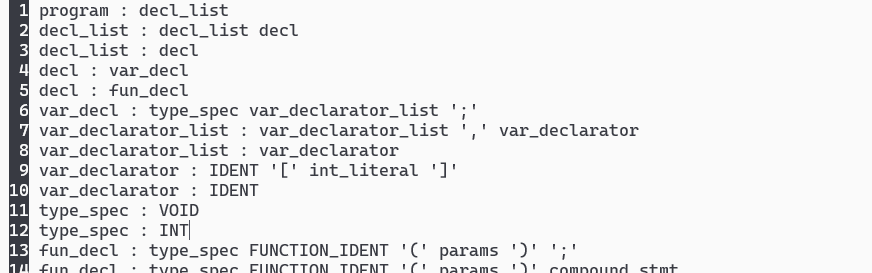

进行解析 (有二义性)

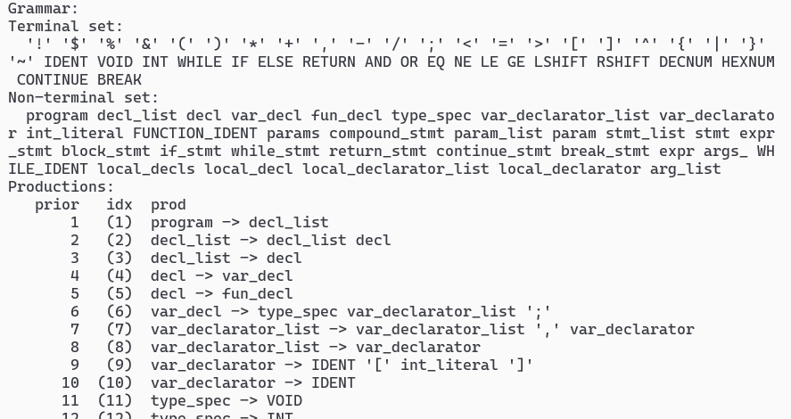

或者以yacc格式的文法规则 (繁琐一点)

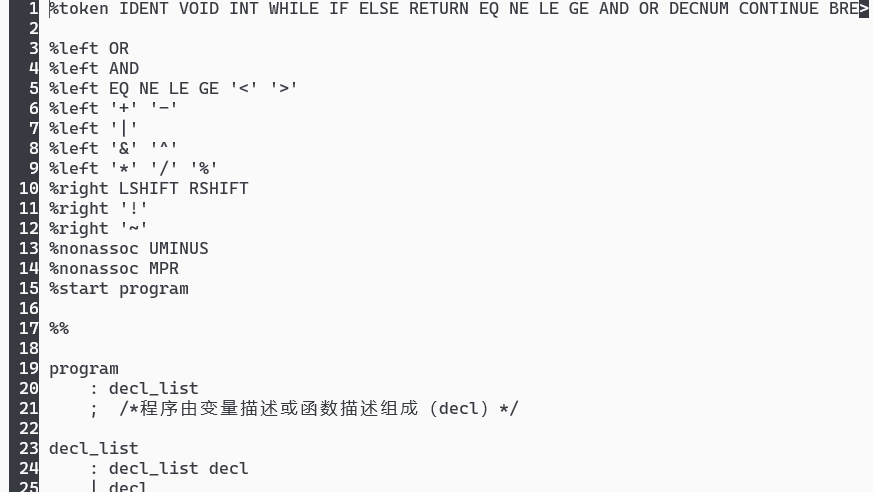

进行解析 (通过定义结合性和优先级消除了二义性)

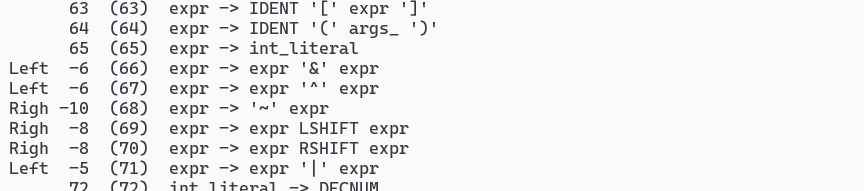

并产生相应的LALR(1)语法分析器，使得你可以像这样即时地解析

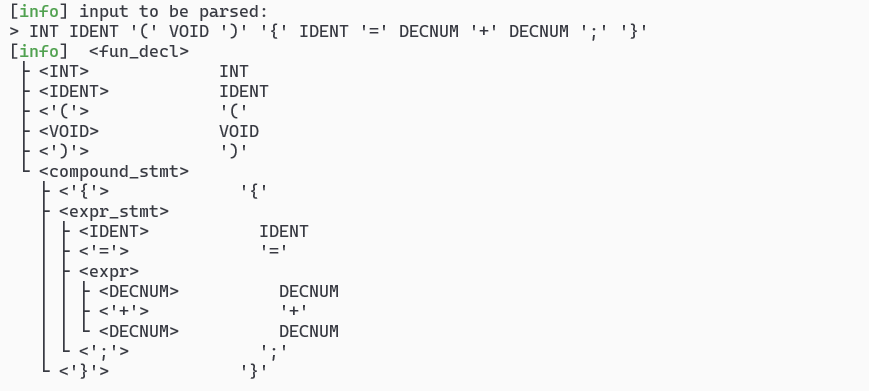

并且，允许你把这样格式的词法规则 (正则表达式) 

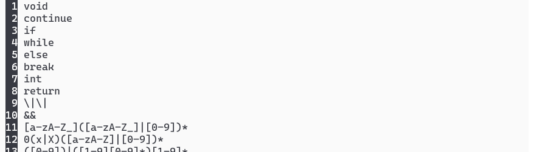

解析，并产生相应的DFA词法分析器，使得你可以这样即时解析

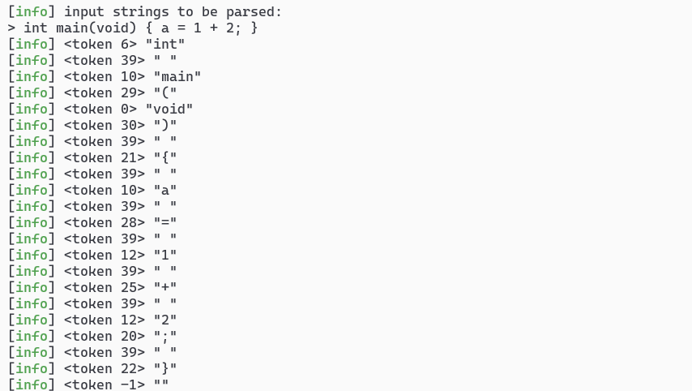

并且提供生成上述的词法、语法分析器代码的功能，使得你可以将生成的解析器用于任何地方

## Quick Start

查看命令行帮助. 

```bash
$ cd build
$ ./standalone/kriller --help
```

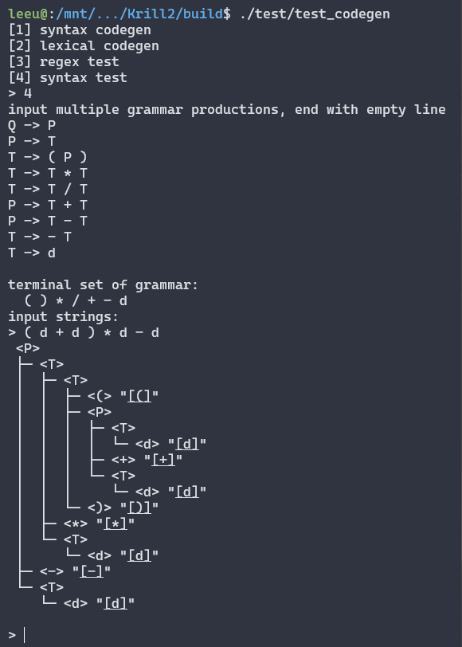

读取一个包含若干条正则表达式的文件，得到词法解析器 (`-l`)，并立即进行交互测试 (`-t`): 

```bash
$ ./standalone/kriller -l -t ../test/grammar/calculator.lexical
> 12*3+4
```

读取一个包含若干条BNF文法规则的文件，得到LALR(1)语法解析器 (`-s`)，并立即进行交互测试 (`-t`): 

```bash
$ ./standalone/kriller -s -t ../test/grammar/calculator.syntax
> d + d * d
```

> 这里报warning是因为给定的文法规则中有冲突，默认按照定义的先后顺序决定优先顺序，但更推荐地是通过二义性或者显式地定义优先级来彻底消除该隐患。
> 通过查看日志或者要求显示更详细的中间信息 (`-v`) 来查看冲突的是哪些文法规则。

读取一个yacc格式的文法规则文件，得到LALR(1)语法解析器 (`-s`)，并立即进行交互测试 (`-t`): 

```bash
$ ./standalone/kriller -S -t ../test/grammar/minic.syntax.yacc
> INT IDENT '(' VOID ')' '{' '}'
```

或者不进行测试, 直接生成解析器跳转表代码 (`-g`). 

```bash
$ ./standalone/kriller -S -g ../test/grammar/minic.syntax.yacc
```

> 如何使用生成的解析器代码, 见 [下一章节](#how-to-use-parser-code)

将结果写入到文件而不是输出到屏幕上 (`-o file`), 并显示更详细的中间信息 (`-v`). 

```bash
$ ./standalone/kriller -v -S -g ../test/grammar/minic.syntax.yacc -o a.out
```

<span id="how-to-use-parser-code"></span>

### 解析器代码如何封装使用

输出的代码是词法/语法解析器的跳转表部分，
它们并不是独立的(standalone), 需要依赖`krill`的代码, 才能正常工作. 

如果你需要一个解析器，又不介意在你的项目中引入krill，那么请参考`standalone/kriller.cpp`本身, 
通过使用`krill::runtime::SyntaxParser`, `krill::runtime::LexicalParser`就能方便地完成基础解析. 

如果你需要一个解析器, 但希望它是无依赖的, 那么请参考 `standalone/calc.cpp`, 它是用 kriller 生成的词法解析器的跳转表改制成的无依赖简易计算器, 具备了完整的
词法解析和语法解析功能, 不仅不对 krill 存在任何依赖, 所需的代码量也很小, 因为它们的核心部分
 (`DFA`/`ActionTable`) 都是基础数据结构. 

## why kriller?

我真的认为 kriller 比 yacc 要好, 因为. 

1. **解耦**: krill设计的解析器是跳转表和业务代码解耦的. 	
   添加新的语法规则后重新产生解析器代码时, 只需要复制粘贴覆盖掉原来的跳转表代码即可, 业务部分不受影响.
   增量更新也是完全可以的. 
2. **易于自定义**: krill采用了通用数据结构 (主要就是`std::map`) 作为DFA和ActionTable的支撑, 
   格式上是原汁原味的教科书定义, 你想用`krill::runtime::SyntaxParser`, 
   `krill::runtime::LexicalParser`也行，想自己撸一个零依赖的, 功能更多的解析器也很简单. 
3. **学习成本低**: lex和yacc的学习成本太高了, 我们定义了一套更简单的语法规则, 简单到你连`%token`都不需要
   预先定义. 不知道左右结合也没有关系, 全部用默认的就好, 如果发生二义性我们再提醒你. 
4. **解析速度快**: <!-- kriller没有yacc快. 但我们曾经写过另一个很糟糕的解析器生成器(seu-lex-yacc), 
   解析一个c99子集的文法就要花费超过10分钟的时间, 解析完之后编译又要花10分钟, 那是真正的灾难. 
   在krill上面我们避开了那些失败的设计, --> 我们对算法核心部分进行profile, 对高频纯函数添加了缓存优化,
   使得原本需要10分钟的工作只需10秒即可完成. （虽然距离秒出还有距离，我猜是因为我们先建立LR(1)分析表再将其转为LALR(1), 而不是直接建立LALR(1), 但这个速度我们觉得也很酷!） 
5. **友好的调试信息**: krill接入了spdlog，不仅做了一些简单的错误定位, 还允许你查看日志文件以定位错误
   所在. 为了便于检查解析结果, 你还可以打印Abstract Parsing Tree看看是否符合预期. 
6. **饱经测试**: krill不仅写了一大堆`assert`以确保不会出现意外, 也准备了许多测试用例. 你可以信任它的正确性. 
7. **名字很帅**. 

# mico

mico 是专门为minisys（seu的一门课，设计编译器、汇编器和cpu令其协同工作）设计的编译器, 你可以用它解析mini-c的代码, 生成中间表示, 施加机器无关优化, 以及产生mips代码. 

简单来说, 它可以将这样的mini-c代码文件 (一个阉割版的c)

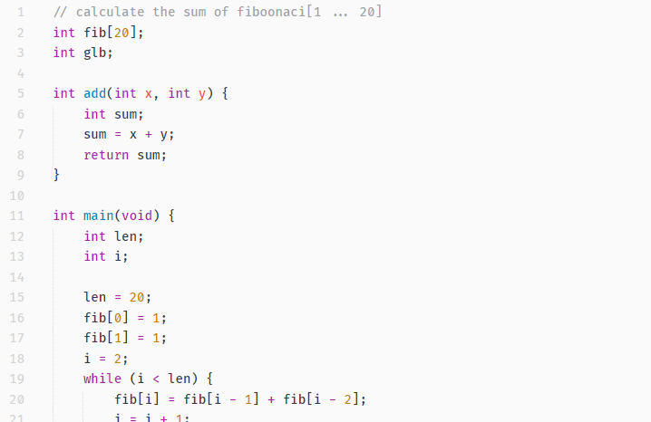

解析成这样的抽象语法树

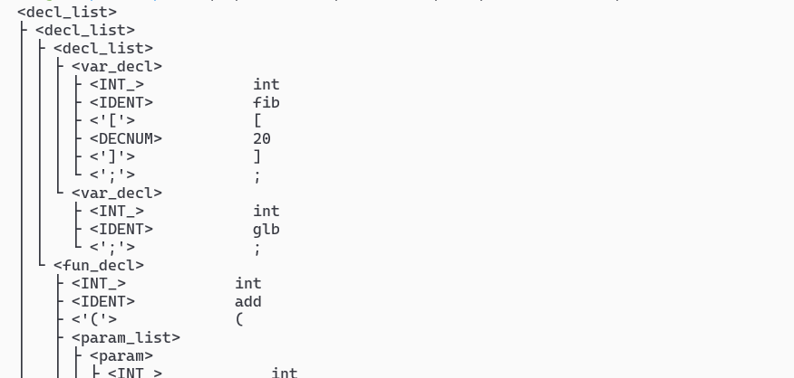

然后生成中间表示（SSA, 对llvm拙劣的效仿）, 进行机器无关优化（公共子表达式消除） 

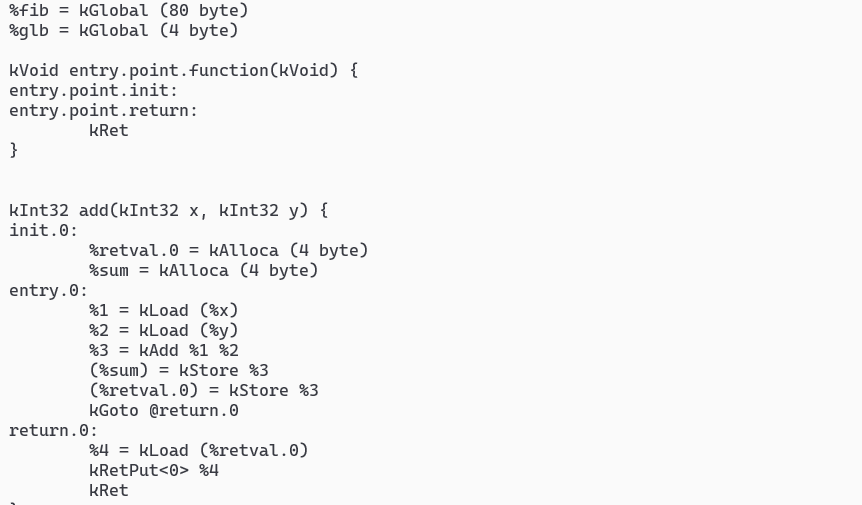

最后生成mips的代码（图染色寄存器分配）

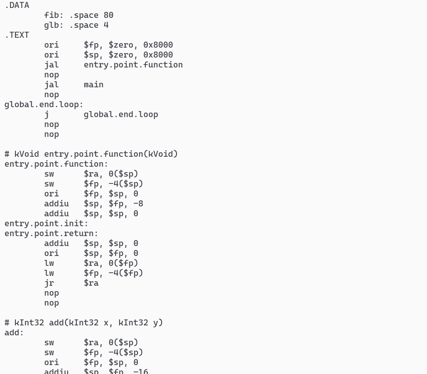

## Quick Start

查看命令行帮助. 

```bash
$ cd build
$ ./standalone/mico --help
```

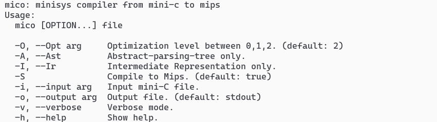

解析 mini-c 代码文件 `06.c` , 打印AST (`-A`). 

```bash
$ ./standalone/mico ../test/minic-testcase/06.c -A
```

解析 mini-c 代码文件 `06.c` , 生成中间表示 (`-I`), 不做任何优化 `-O0`. 

```bash
$ ./standalone/mico ../test/minic-testcase/06.c -I -O0
```

解析 mini-c 代码文件 `01.c` , 生成汇编代码 (`-S`)

```bash
$ ./standalone/mico ../test/minic-testcase/06.c -S
```

将结果写入到文件而不是输出到屏幕上 (`-o file`), 并显示更详细的中间信息 (`-v`). 

```bash
$ ./standalone/mico -v ../test/minic-testcase/06.c -S -o a.out
```

# 设计思路

这个东西反正不会有人看的. 

编译器前端有两种思路, 要么像lex和yacc那样旨在生成standalone的解析器(解析器是一个代码文件), 
要么像seu-lex-yacc那样生成strongly-dependent的解析器(解析器是一个运行时对象). 

前者的耦合性和可读性是一场灾难, 很不方便修改. 
后者要固定化成一个类要继承太多东西, 嗯, 还是很不方便修改. 
krill试图在二者之间寻找一个平衡: 

1. 体积最容易膨胀的DFA, ActionTable等跳转表是standalone的
2. 定义如何利用跳转表的LexicalParser, SyntaxParser是dependent的

## 词法解析器 (LexicalParser)

核心是一个DFA, 一般由n个正则表达式合成得到. 
返回的`token.id`记录了当前匹配的是哪个正则表达式(0 ~ n-1), `token.lval`记录了字面量. 
设计上是希望词法解析器传出token以后, 由用户手动指定如何从当前的id(lexicalId)变换到语法
解析的id(syntaxId), 或者用户可能希望丢弃它(比如说匹配到的是空格). 这些都不由词法解析器负责. 

## 语法解析器 (SyntaxParser)

核心是一个lr1动作表. 

## 语法制导翻译 (Syntax-Directed-Translation)

由于mini-c的语法制导定义里面不仅包含S-属性(synthesis), 也包含H-属性(inHerited) 
(例如, `continue`和`break`), 语法制导翻译至少要等文件扫描结束 / 抽象语法树(AST)建立完毕后才能完成. 
因此, 我们选择如下翻译方案: 

1. 先不执行任何翻译动作, 建立抽象语法树AST
2. 在AST上执行递归下降

## 中间代码优化 (Intermediate Representation Optimization)

设计上参考了LLVM的中间代码. 

先从AST上翻译出最粗糙的中间代码, 然后执行多遍扫描, 每次扫描执行一项优化, 目前实现的有: 

1. 常量传播
2. 寄存器分配(图染色)
3. (局部)公共子表达式消除

## 机器代码生成 (Backend)

这一步的工作特别少, 因为寄存器分配的信息已经存储在中间代码上了，只需要执行近似于一对一的翻译即可. 
主要的难点在于过程调用的寄存器现场恢复. 

生成的mips代码在MARS(一个mips模拟器)上通过了测试。

## 链接

如果需要合并两个汇编代码文件，有以下问题需要注意: 

1. 产生汇编时有些代码退化为了直接取内存偏移. 因此无法合并多个含有数据段的汇编文件. 
2. 每个汇编代码的entry.point.function负责main之前的全局初始化工作
3. main只需要一个

这些问题我将会修复. 

# TODO

1. - [x] 增加测试用例, 确保AST无误 
2. - [x] 提高lr1分析速度
3. - [ ] lr1错误恢复
4. - [x] 中间代码生成
5. - [x] 中间代码优化
6. - [x] 机器代码生成
7. - [x] 报错提示(包括源程序行号定位)
8. - [x] 公共子表达式消除
9. - [x] 支持局部定义域块
10. - [x] 支持变量定义时初始化
11. - [ ] 支持for
12. - [ ] 消除全局数据段偏移使用，方便链接


logo
[README/logo.png]: 
