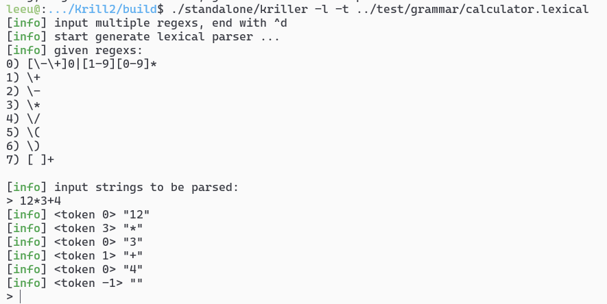
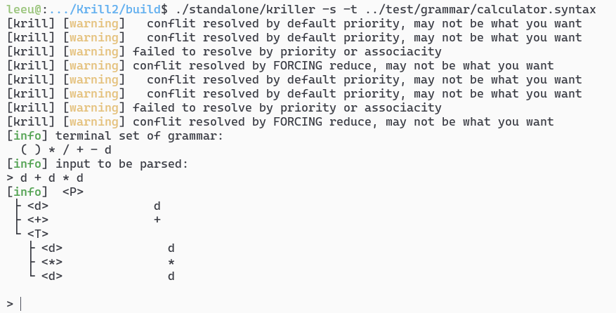
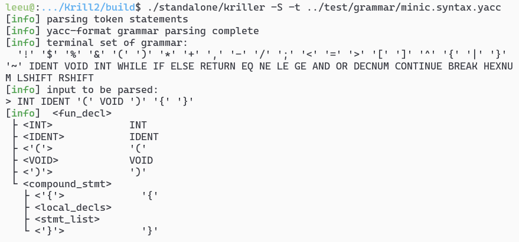

# Krill: a frontEnd Compiler

## 运行环境要求

- Cmake 3.16 above
- g++9.0 / clang++9.0 above
- std=c++17 above

## 怎么运行

```bash
$ cd build
$ cmake ..
$ make -j4
````

可以跑一下这几个样例试试正不正常

```bash
$ ./test/test_automata
$ ./test/test_grammar
$ ./test/test_regex
$ ./test/test_lexical
$ ./test/test_syntax
````

## 简介

命名空间做了一定的划分: 

- `krill::type`: 基础通用类型, 如`DFA`, `Grammar`, `ActionTable`等
- `krill::utils`: 通用工具, 如字符串处理函数和`AttrDict`
- `krill::regex`: 正则表达式解析器
- `krill::runtime`: 提供了`LexicalParser`和`SyntaxParser`
- `krill::minic`: mini-C的词法/ 语法解析器
- `krill::log`: 日志

该工程测试样例很全, 见`./test/test_*.cpp`. 
每一个都可以单独运行. 

## 怎么使用

我们向你强烈推荐`test_codegen`和`test_minic`两个交互性的测试程序. 

### test_codegen

`test_codegen`为编译器前端开发和调试提供了6个简易功能: 

1. 语法解析器-代码生成
2. 词法解析器-代码生成
3. 正则表达式-立即测试
4. 语法解析器-立即测试
5. yacc文件解析-词法解析器-立即测试
6. yacc文件解析-词法解析器-代码生成

```bash
$ make test_codegen
./test/test_codegen
```

立即测试功能允许你输入多条正则表达式/文法规则后, 立即运行时编译, 得到词法/语法解析器, 
并交互式测试其运行状况. 非常酷. 




你甚至可以直接把miniC的文法的正则表达式丢进去(见`docs/c99.l.in`, `docs/c99.y.in`), 它会需要一点
时间编译, 但不会太久(不超过30s)! 

代码生成功能运行你输入多条正则表达式/文法规则后, 输出词法/语法解析器的代码(半成品). 
它们并不是独立的(standalone), 需要依赖`krill`的其他代码才能正常工作, 不过说真的, 它们的核心部分
(`DFA`/`ActionTable`) 可都是基础数据结构, 要将它们改制作为独立的解析器也并不困难. 

当然, 最值得称赞的是, 因为krill采用了非常基础的数据结构作为DFA和ActionTable的支撑(去类型化, 全int), 
所以生成的解析器不仅代码量相对小, 而且编译速度很快(和seuLexYacc相比). 

如果你不太明白如何修改利用这个半成品, 你可以参考`minic.cpp`, 它就是由`test_codegen`生成的解析器. 

### test_minic

`test_minic`是专门为mini-C设计的编译器, 你可以用它解析mini-C的代码, 生成中间代码, 以及产生mips代码。

```bash
$ make test_minic
./test/test_minic -Ls < ../test/minic-testcase/01.c
```

如果我准备的正则表达式和文法没有问题, 它应该能很好地解析mini-C的代码. 





## 设计思路

编译器前端有两种思路, 要么像lex和yacc那样旨在生成standalone的解析器, 
要么像seuLexYacc那样生成strongly-dependent的解析器. krill试图在二者之间寻找一个平衡: 

1. 最核心的DFA, ActionTable是standalone的 ()
2. 上层的LexicalParser, SyntaxParser是dependent的 (但也是可替换的)

### 词法解析器 (LexicalParser)

核心是一个DFA, 一般由n个正则表达式合成得到. 
返回的token.id记录了当前匹配的是哪个正则表达式(0 ~ n-1), token.lval记录了字面量. 
设计上是希望词法解析器传出token以后, 由用户手动指定如何从当前的id(我喜欢称其为lexicalId)变换到语法
解析的id(我喜欢称其为syntaxId), 或者用户可能希望丢弃它(比如说匹配到的是空格). 这些都不由词法解析器负责. 

### 语法解析器 (SyntaxParser)

核心是一个lr1动作表. 
为了在归约过程中执行动作, 语法解析器允许用户绑定函数到每一个归约位置上 (语法制导翻译, SDD). 
用了AttrDict存放Annotated Parsing Tree的各种中间变量, 因为AttrDict实际上是一个`map<string, any>`, 
可以在运行时任意增减属性, 如果不出错的话用起来还是比较方便的. 

美中不足的地方是: 报错提示不够友好. 不过好处是: 修改SyntaxParser的代码, 所有它的实例都能受益. 

### 语法制导翻译 (Syntax-Directed-Translation)

由于mini-c的语法制导定义里面不仅包含S-属性(synthesis), 也包含H-属性(inHerited) 
(例如, `continue`和`break`), 语法制导翻译至少要等文件扫描结束/ 抽象语法树(AST)建立完毕后才能完成. 
因此, 我们选择如下翻译方案: 

1. 先不执行任何翻译动作, 建立抽象语法树AST
2. 在AST上执行递归下降

### 中间代码优化

设计上参考了LLVM的中间代码. 

先从AST上翻译出最粗糙的中间代码, 然后执行多遍扫描, 每次扫描执行一项优化, 目前实现的有: 

1. 常量传播
2. 寄存器分配

### 机器代码生成

这一步的工作特别少, 因为寄存器分配的信息已经存储在中间代码上了，只需要执行近似于一对一的翻译即可. 

## TODO

1. - [x] 增加测试用例, 确保AST无误 
2. - [x] 提高lr1分析速度
3. - [ ] lr1错误恢复
4. - [x] 中间代码生成
5. - [x] 中间代码优化
6. - [x] 机器代码生成
7. - [x] 报错提示(包括源程序行号定位)
8. - [x] 公共子表达式消除
9. - [ ] 支持局部定义域块


